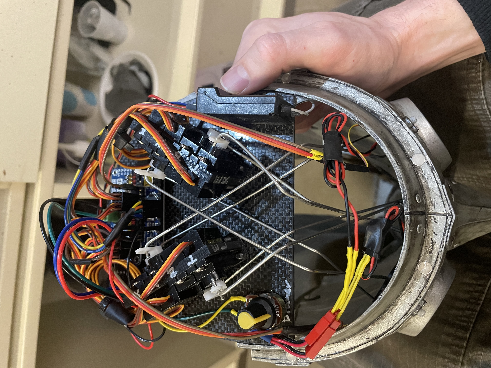
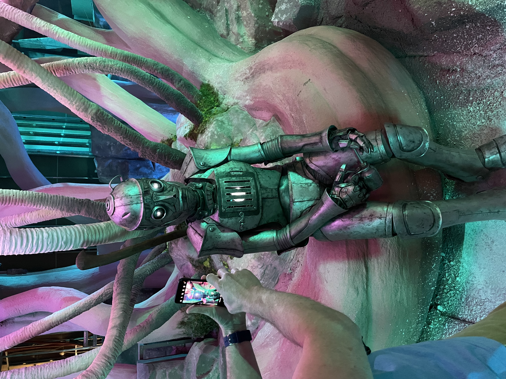
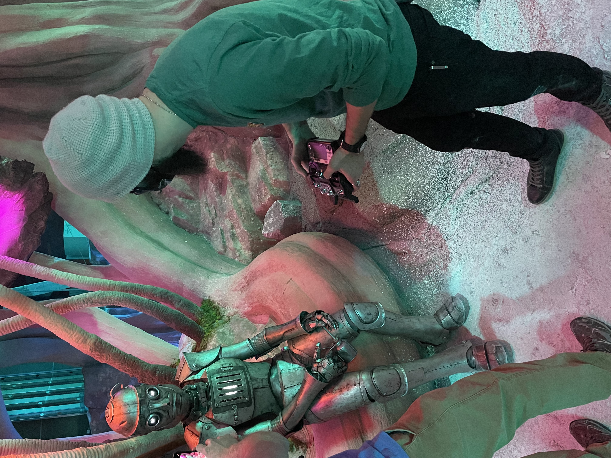

# Animatronic Helmet Control System  
### Dreamwalk – Tin Man Headpiece

## Project Overview
I designed and built a wearable **animatronic helmet** for Dreamwalk as part of a short film promotion. The goal was to create a reliable, lightweight electromechanical system capable of coordinated motion and lighting effects while being safely worn and operated by an actor.

The project required integrating mechanical design, embedded control, wiring, and real-time troubleshooting within tight physical and usability constraints.

## System Description
The animatronic system was housed inside a helmet styled as a Tin Man character. The system controlled multiple mechanical movements and lighting effects while remaining compact, lightweight, and comfortable for the performer.

Key system requirements included:
- Coordinated motion across multiple actuators
- Safe operation near the user’s head
- Reliable real-time control
- Remote operation capability
- Modular mechanical design for maintenance and adjustments

## Hardware Components
- Arduino Nano microcontroller
- 10 hobby servo motors 
- Servo control board
- LEDs for lighting effects
- RC receiver and transmitter
- Custom 3D printed mechanical components
- Power distribution and wiring harnesses

## Control & Software
- Programmed embedded control logic in **C** on Arduino
- Coordinated multiple servo outputs for expressive motion
- Integrated RC input for remote triggering and control
- Implemented timing and sequencing logic for smooth actuation
- Tuned motion limits to prevent mechanical binding and ensure user safety

## Mechanical Design
- Designed custom mechanisms in CAD to fit within the helmet geometry
- 3D printed components for rapid iteration and weight reduction
- Balanced actuator placement to reduce strain and improve reliability
- Designed assemblies for easy disassembly and maintenance

## My Role
- Mechanical design and CAD modeling
- 3D printing and mechanical assembly
- Electrical wiring and system integration
- Embedded programming and motion sequencing
- Debugging mechanical, electrical, and software issues
- System testing and refinement prior to filming

## Challenges & Solutions
**Space constraints:**  
The limited interior volume required compact mechanisms and careful wire routing. Multiple design iterations were used to optimize layout and serviceability.

**Motion coordination:**  
Early tests showed unsynchronized servo movement. Control logic was refined to improve timing and smooth transitions.

**Reliability during wear:**  
Because the system was worn by an actor, reliability and safety were critical. Motion limits and mechanical stops were implemented to reduce risk and fatigue.

## Results
- Delivered a fully functional wearable animatronic helmet
- Successfully used in a filmed promotional production
- Demonstrated reliable operation during extended wear
- Achieved coordinated motion and lighting effects

## What I Learned
- Designing electromechanical systems under human-safety constraints
- Coordinating multiple actuators using embedded control logic
- Rapid iteration using CAD and additive manufacturing
- System-level debugging across mechanical, electrical, and software domains

## Code

[View Arduino Control Code](code/animatronic/tinman_helmet_control.ino)

## Control Code (Excerpt)

```cpp
        case Behaviour::TinMan: {
     // The ON period of almost all RC pulses ranges from 1000us to 2000us.
      // We'll remap this to an angle 
      
      //Right and Left Eye X Movement (Channel 1 & Outputs 0 & 8)
      int eyeXright = map(channelInput[0], 1000, 2000, -50, 50);
      channelOutput[8] = pwmServo.pwmForAngle(eyeXright);
      int eyeXleft = map(channelInput[0], 1000, 2000, -50, 50);
      channelOutput[0] = pwmServo.pwmForAngle(eyeXleft);

      //Right and Left Eye Y Movement (Channel 2 & Outputs 1 & 9)
      int eyeYright = map(channelInput[1], 1000, 2000, -30, 30);
      channelOutput[9] = pwmServo.pwmForAngle(eyeYright);
      int eyeYleft = map(channelInput[1], 1000, 2000, 30, -30);
      channelOutput[1] = pwmServo.pwmForAngle(eyeYleft);

```

## Video Demo 

[▶ Watch Short Demo of Tin Man In Progress](https://youtube.com/shorts/5JMsWlTXtZM)

<iframe width="560" height="315"
src="[https://youtube.com/shorts/5JMsWlTXtZM]"
title="Tin Man In Progress Demo"
frameborder="0"
allowfullscreen>
</iframe>

[▶ Watch Short Demo of Tin Man Completed](https://youtube.com/shorts/tVqaoMflU6U)

<iframe width="560" height="315"
src="[https://youtube.com/shorts/tVqaoMflU6U]"
title="Tin Man Completed Demo"
frameborder="0"
allowfullscreen>
</iframe>

## Project Photos








[Portfolio Main Page](index.md)


