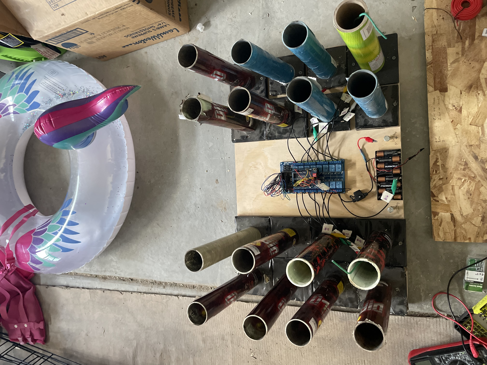

# Automated Firework Ignition Control System

## Project Overview
This project involved designing and building a **multi-channel ignition control system** for coordinated firework launching. The system was designed to allow **remote, controlled ignition** of multiple channels using an embedded controller and electrically actuated relays.

The focus of the project was **electrical power management, control logic, and system reliability**, rather than pyrotechnics themselves.

## System Objectives
- Safely control multiple ignition channels independently
- Electrically isolate control logic from high-current loads
- Provide reliable, repeatable ignition timing
- Maintain physical separation between operator and ignition hardware
- Emphasize system safety and controlled operation

## System Architecture
The system was divided into three main subsystems:

### Control Layer
- **Arduino Mega** microcontroller
- Digital control logic for channel selection and sequencing
- Software-based enable/disable logic to prevent accidental activation

### Switching & Isolation Layer
- **16-channel relay board**
- Electrical isolation between low-voltage logic and high-current outputs
- Individual channel control for each ignition circuit

### Power Delivery Layer
- **12V automotive battery**
- High-current capability required for resistive heating elements
- Dedicated power path separate from control electronics

## Ignition Method (High-Level)
Ignition was achieved using **resistive heating elements** attached to firework fuses. When energized, the element rapidly increased in temperature, initiating ignition.

> **Note:** This description is intentionally high-level and omits procedural details. All testing and operation were conducted with appropriate safety precautions.

## Electrical Design Considerations
- Relay isolation prevented high current from reaching the microcontroller
- Separate grounding paths reduced electrical noise and risk
- Wire routing and labeling minimized cross-channel interference
- Power delivery was sized to handle simultaneous channel activation

## Control Logic
- Each ignition channel was controlled independently via relay outputs
- Logic sequencing ensured deliberate activation
- Manual arming and triggering steps were required before energizing any channel
- Fail-safe behavior ensured all channels defaulted to an inactive state on reset

## My Role
- System architecture and design
- Microcontroller selection and programming
- Relay board integration
- Power system design and wiring
- System testing and troubleshooting
- Risk assessment and safety planning

## Challenges & Solutions
**High-current requirements:**  
Initial testing showed insufficient heating using low-voltage sources. A dedicated high-current power source was selected to meet system demands.

**Electrical isolation:**  
Relays were used to fully isolate logic-level signals from high-power circuits, protecting the microcontroller.

**Reliability across channels:**  
Careful wiring practices and channel labeling ensured predictable, repeatable operation.

## Results
- Successfully demonstrated multi-channel ignition control
- Reliable, independent channel activation
- Clear separation between control logic and power delivery
- Stable operation under high-current load conditions

## What I Learned
- Designing control systems for high-current applications
- Importance of electrical isolation in mixed-voltage systems
- Power distribution and load management
- Building safety-focused control logic
- System-level thinking under real-world constraints

## Video Demo

[▶ Watch Short Demo of Interactive Vertical Carousel](https://youtube.com/shorts/b-jeW_xh8_I)

<iframe width="560" height="315"
src="https://youtube.com/embed/b-jeW_xh8_I"
title="Automated Firework Ignition System Demo"
frameborder="0"
allowfullscreen>
</iframe>

[▶ Watch Short Demo of Interactive Vertical Carousel](https://youtube.com/shorts/ymYzjWPgS60)

<iframe width="560" height="315"
src="https://youtube.com/embed/ymYzjWPgS60"
title="Automated Firework Ignition System in Action Demo"
frameborder="0"
allowfullscreen>
</iframe>

## Project Photos

